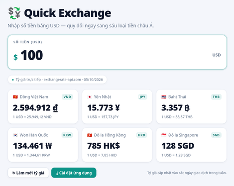

# 💱 Quick Exchange

A tiny single-page app (Vietnamese UI) that converts between seven currencies:

🇺🇸 USD · 🇻🇳 VND · 🇯🇵 JPY · 🇹🇭 THB · 🇰🇷 KRW · 🇭🇰 HKD · 🇸🇬 SGD

**[Live demo](https://teefan.github.io/quick-exchange/)**



## Features

- Clean light theme with large, readable type — mobile-first responsive layout
- Type an amount in any of the seven currencies and the other six update instantly
- Values of 1 or more are rounded to whole numbers; smaller values keep a few
  decimals so they stay meaningful
- Live rates from [exchangerate-api.com](https://www.exchangerate-api.com), with
  [Frankfurter](https://frankfurter.dev) (European Central Bank data) as a backup
- Rate-limit friendly: rates are cached for 30 minutes and the APIs are called at
  most once a minute, with a visible refresh cooldown
- Falls back to a built-in rate snapshot when offline
- Click (or tap) any card to copy the converted amount
- **Installable as an app**: web app manifest + service worker, so it launches
  standalone from the home screen and works offline

## Install as an app

- **Android / desktop Chrome**: open the live demo and click **⤓ Install app**
  (or use the browser's install icon in the address bar).
- **iPhone / iPad Safari**: open the live demo, tap **Share ⎋**, then
  **Add to Home Screen**. The app shows this hint via its install button.

## Run locally

No build step — it's plain HTML/CSS/JS. Any static server works:

```sh
python3 -m http.server 8000
# then open http://localhost:8000
```

> Service workers require `https` or `localhost`, so use the server above
> rather than opening `index.html` directly from disk.

## Deploy

The app is deployed with GitHub Pages straight from the `main` branch root.

```sh
gh repo create quick-exchange --public --source=. --push
gh api -X POST repos/{owner}/quick-exchange/pages \
  -f "source[branch]=main" -f "source[path]=/"
```

## Structure

| File                    | Purpose                                    |
| ----------------------- | ------------------------------------------ |
| `index.html`            | Markup + PWA metadata                      |
| `styles.css`            | Styling (dark theme, mobile breakpoints)   |
| `app.js`                | Rates, conversion, install prompt          |
| `manifest.webmanifest`  | Web app manifest for installation          |
| `sw.js`                 | Service worker — offline caching           |
| `icons/`                | App icons (SVG source + generated PNGs)    |
| `docs/preview.png`      | README screenshot                          |
